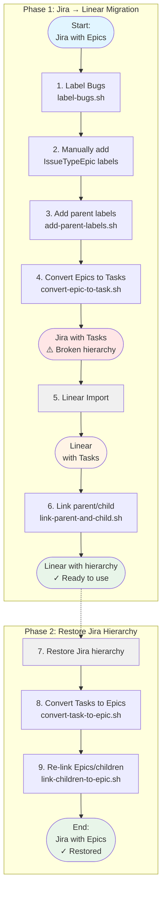

# linear-migration-tools

Helper scripts for migrating issues between Jira and Linear. These tools use the Atlassian CLI (`acli`) and Jira REST API to manipulate Jira issues during migration processes.

## Prerequisites

- [Atlassian CLI (acli)](https://developer.atlassian.com/cloud/acli/installation/) must be installed and configured
- `jq` for JSON parsing
- For scripts using Jira REST API, set these environment variables:
  - `JIRA_USER_EMAIL`
  - `JIRA_API_TOKEN`
- For scripts using Linear API, set this environment variable:
  - `LINEAR_API_KEY` (get it from https://linear.app/settings/api)

## Migration Workflow

Follow these steps to migrate issues from Jira to Linear and back:



### Phase 1: Prepare Jira issues for Linear migration

1. **Label Bug issues** (optional but recommended):
   ```bash
   ./to-linear/label-bugs.sh <PROJECT-KEY> [--dry-run]
   ```
   Adds "Bug" labels to Bug issue types to preserve type information.

2. **Manually mark Epics** you want to migrate:
   Add the label `IssueTypeEpic` to all Epic issues you want to include in the migration.

3. **Add parent relationship labels**:
   ```bash
   ./to-linear/add-parent-labels.sh <PROJECT-KEY> [--dry-run]
   ```
   Adds `parentIs<EPIC-KEY>` labels to child issues to preserve Epic relationships.

4. **Convert Epics to Tasks**:
   ```bash
   ./to-linear/convert-epic-to-task.sh <PROJECT-KEY> [--dry-run]
   ```
   Converts Epic issues to Task type (Linear doesn't support Epics).

5. **Run Linear import**:
   Use Linear's Jira import feature to migrate the issues.

6. **Link parent and child issues in Linear**:
   ```bash
   ./to-linear/link-parent-and-child.sh <TEAM-KEY> [--dry-run]
   ```
   Links child issues to parent issues in Linear using the `parentIs` labels.

### Phase 2: Restore Epic hierarchy in Jira

7. **Convert Tasks back to Epics**:
   ```bash
   ./from-linear/convert-task-to-epic.sh <PROJECT-KEY> [--dry-run]
   ```
   Converts issues labeled with `IssueTypeEpic` back to Epic type.

8. **Re-link Epics and children**:
   ```bash
   ./from-linear/link-children-to-epic.sh <PROJECT-KEY> [--dry-run]
   ```
   Links child issues back to their parent Epics using the `parentIs` labels.

## Tools

### to-linear/

Scripts for preparing Jira issues before migrating TO Linear:

#### `label-bugs.sh`
**Purpose**: Adds "Bug" labels to all Bug issue types that don't already have bug labels
**Motivation**: Preserves issue type information through labels when migrating to Linear, where the original issue type metadata might not be preserved.

Usage:
```bash
./to-linear/label-bugs.sh <PROJECT-KEY> [--dry-run]
```

#### `add-parent-labels.sh`
**Purpose**: Adds parent relationship labels to child issues of Epics
**Motivation**: Linear doesn't have the same Epic/Story hierarchy as Jira. This script adds `parentIs<EPIC-KEY>` labels to all child issues, preserving the parent-child relationships for reference after migration.

Usage:
```bash
./to-linear/add-parent-labels.sh <PROJECT-KEY> [--dry-run]
```

#### `convert-epic-to-task.sh`
**Purpose**: Converts all Epic issues to Task issue type
**Motivation**: Linear doesn't have Epic issue types. Converting Epics to Tasks before migration ensures they migrate as regular issues instead of being dropped or causing errors.

Usage:
```bash
./to-linear/convert-epic-to-task.sh <PROJECT-KEY> [--dry-run]
```

#### `link-parent-and-child.sh`
**Purpose**: Links child issues to parent issues in Linear using the GraphQL API
**Motivation**: After importing issues into Linear, this script restores the parent-child relationships using the `parentIs` labels that were added in Jira. It creates sub-issue relationships in Linear.

Usage:
```bash
./to-linear/link-parent-and-child.sh <TEAM-KEY> [--dry-run]
```

**Note**: This script requires the `LINEAR_API_KEY` environment variable for Linear API authentication.

### from-linear/

Scripts for processing issues migrated FROM Linear back to Jira:

#### `convert-task-to-epic.sh`
**Purpose**: Converts issues labeled with "IssueTypeEpic" back to Epic issue type
**Motivation**: Recreates Epic hierarchy after migrating issues back from Linear. Issues that were originally Epics and were marked with "IssueTypeEpic" labels get converted back to proper Epic issue types.

Usage:
```bash
./from-linear/convert-task-to-epic.sh <PROJECT-KEY> [--dry-run]
```

#### `link-children-to-epic.sh`
**Purpose**: Links child issues back to their parent Epics using `parentIs` labels
**Motivation**: Restores the Epic/child relationships that were preserved via labels during the Linear migration. Uses Jira REST API to set parent links.

Usage:
```bash
./from-linear/link-children-to-epic.sh <PROJECT-KEY> [--dry-run]
```

**Note**: This script requires environment variables for Jira REST API authentication.

## Common Options

- `<PROJECT-KEY>`: Jira project key (e.g., "PAT", "PROJ")
- `<TEAM-KEY>`: Linear team key (e.g., "ENG", "PROD")
- `--dry-run`: Preview changes without executing them

## Customizing Issue Selection

All scripts use JQL (Jira Query Language) or GraphQL queries to select which issues to process. If the default selection doesn't match your needs, you can modify the queries directly in the script files:

- **Jira scripts**: Look for the `--jql` parameter in functions like `get_epics_in_project()` or `get_bug_issues()`
- **Linear scripts**: Look for the GraphQL `query` or `mutation` definitions in functions like `get_parent_issues()` or `get_child_issues_by_label()`

Common customizations:
- Change status filters (e.g., include/exclude "Done" issues)
- Add additional label filters
- Filter by assignee, reporter, or other fields
- Adjust date ranges
